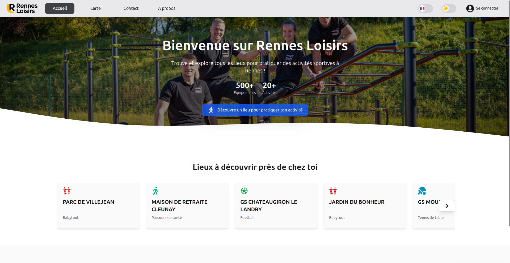

# Rennes Loisirs - Projet IHM-UX-INSA

Rennes Loisirs est une application web développée dans le cadre du cours **Interface Humain‑Machine & Expérience Utilisateur (IHM‑UX)** à l’INSA Rennes.
L’objectif du projet est de proposer une interface moderne, accessible et centrée utilisateur permettant de **découvrir les équipements sportifs de la métropole rennaise** grâce aux données ouvertes (Open Data Rennes Métropole).

L’application a été conçue en appliquant les principes d’ergonomie, de perception visuelle, de hiérarchisation de l’information et de conception centrée utilisateur. Deux phases d’évaluation ont été menées : un **test de perception** et un **test utilisateur**, afin d’améliorer progressivement l’expérience proposée.

## Lancement du projet

Cloner le projet : 

`git clone https://gitlab.insa-rennes.fr/Corentin.Mahieu/ihm-ux-kelian-corentin.git`

Se rendre dans le projet :

`cd ihm-ux-kc/`

Puis lancer le projet avec npm :

`npm run dev`

Accéder à l'interface utilisateur en cliquant sur une des urls proposée.

## Fonctionnalités principales

- **Carte interactive** (Leaflet) affichant les équipements sportifs

- **Filtres dynamiques** (type de sport, catégorie, favoris…)

- **Mode sombre / mode clair**
 
- **Navigation** entièrement accessible au clavier
 
- **Changement de langue** (FR/EN)
 
- **Gestion de compte** : modification du profil, favoris, suppression
 
- **Affordances visuelles** (hover, focus, transitions)
 
- **Interface responsive** (mobile, tablette, desktop)

## Objectifs pédagogiques

- Concevoir une interface centrée utilisateur
 
- Appliquer les principes d’ergonomie et de perception visuelle
 
- Réaliser des tests de perception et tests utilisateurs
 
- Analyser les retours et itérer sur le design
 
- Produire une interface moderne, cohérente et accessible

## Aperçu des pages

- **Accueil** : Hero section, découverte rapide des lieux
 
- **Carte** : visualisation géographique + liste synchronisée
 
- **Profil** : gestion du compte et des favoris
 
- **Contact** : formulaire de message
 
- **À propos** : présentation du projet et des auteurs

## Évaluations réalisées

### Test de perception

- Analyse de la compréhension visuelle de la page d’accueil
 
- Identification des éléments perçus en premier
 
- Vérification de la hiérarchie visuelle et des affordances
 
- Résultats globalement très positifs

### Test utilisateur

- 9 scénarios couvrant l’ensemble des fonctionnalités
 
- Analyse des clics via un outil interne (RecorderWidget)
 
- Identification des points forts et axes d’amélioration
 
- Suggestions intégrées dans la réflexion finale

## Technologies utilisées

- **React** (interface modulaire et réactive)
 
- **Leaflet** (carte interactive)
 
- **TailwindCSS** (design moderne et responsive)
 
- **Open Data Rennes Métropole** (données des équipements sportifs)

## Auteurs

Projet réalisé par :

- **Kelian Ninet** – [@Fir3n0x](https://github.com/Fir3n0x)
- **Corentin Mahieu** - [@S0nju](https://github.com/S0nju)

Dans le cadre du cours **IHM‑UX — INSA Rennes (2025‑2026)**.
